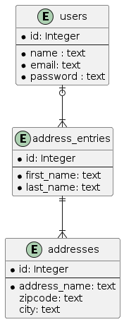
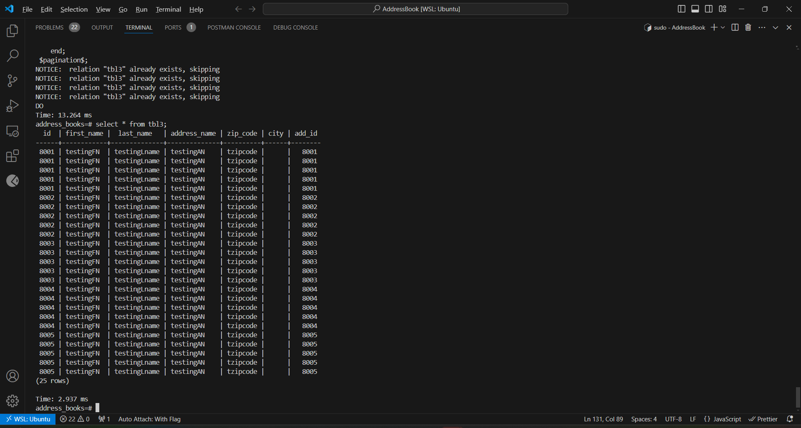
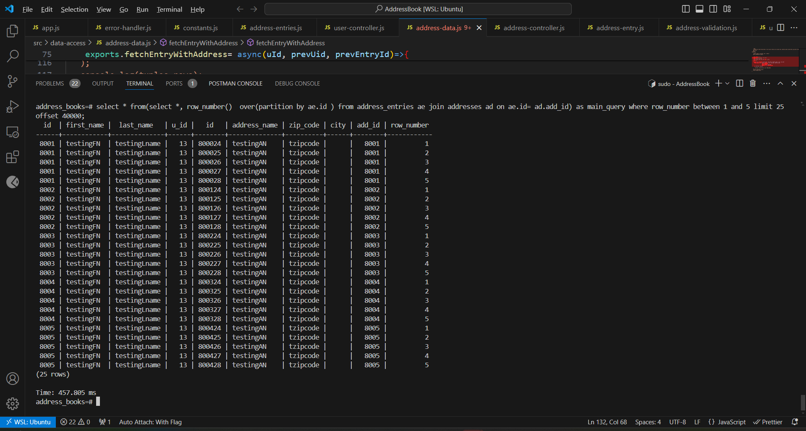
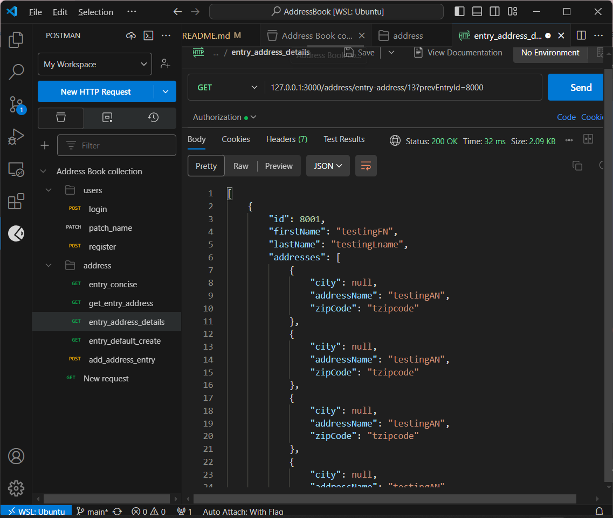

### Overview of the application
This is a node.js application for and Address Book api. The users can sign in, register and be authorized for creating address entry and address resources. The relationship between User entity and address entry entities is one to many(from the user to the address entry entity). The relationship between address entry entity to addresses is one to many.  

The application uses postgres database and implements efficient cursor based pagination. Routers that require joining muliple table are also efficiently implemented through indexing of foreign key attributes and tuple comparison without the need for denormalizing tables for efficient performance.

The requests are authorized using jwt library of node.js. Incoming request bodies are validated using JOI library. The users authenticate thorugh email and password. The passwords are stored salted and hashed. The project also makes use of the modular nature of middlewares and modules to handle verification and error handling.  The application is also organized in the MVC layer. The controller components interact with data through the models data layer. Routes are also organized in their own directory. Some time benchmarks and improvements are shown in the screenshot for optimized sql queries. 

## Query optimization using cursor based pagination and procedural techniques

It is to be noted that address_entries and address entity have one to many relationship where one address entry for a person could include one or more address informations. If the addresses and address_entries constitute large number of entries, then fetching data even through pagination using offset could result in a significant latency for requests requiring join between those relations.  Thus, all tables define an index on the foreign key element thus to use the primary key and foregin key as the cursor to start fetching data. Denormalizing the tables to improve performance could be one option but will result in redundant entries and we might also lose the modeling capability of our application. One example is shown in the image below. We used a procedural constuct and cursor based methods to efficiently fetch PAGE_SIZE(5 in the example) number of address_entries with PAGE_INTERNAL_SIZE(5) number of addresses for an aggregating route for a given user. 

If we used window functions to perform the same grouping and operations while at the same time filtering u_id the time required is 457ms to fetch elements after the 8000th element while that of the procedural method can accomplish this with only 15 ms. 

The output of the route for the request for aggregated resource request is shown below.
